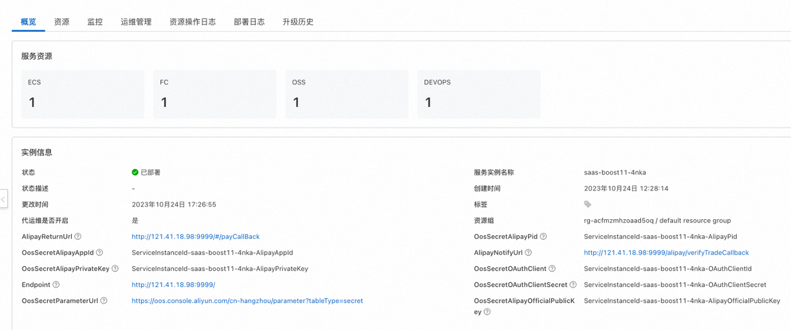
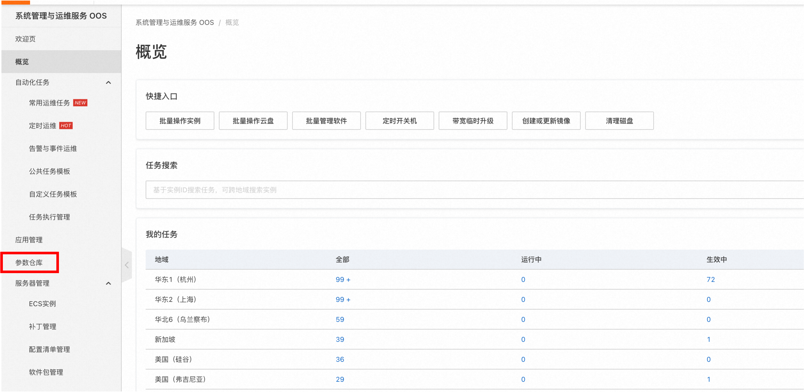
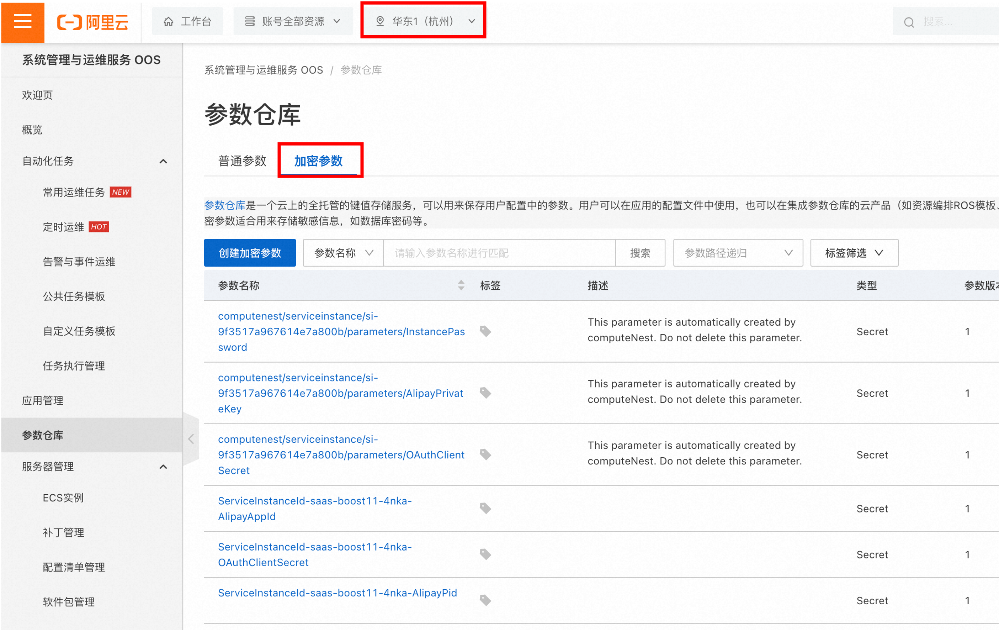

# 计算巢SaaS Boost 开发者指南

## 目录
[引言](#引言)\
[修改SaaS Boost配置参数](#修改saas-boost配置参数)\
[套餐配置](#套餐配置)

## 引言
本指南将为您提供有关如何修改 SaaS Boost 的配置和更加灵活地扩展您的 SaaS 应用程序的详细信息。

## 修改SaaS Boost配置参数
在创建SaaS Boost一键部署实例时，我们配置了一些加密参数。如认证服务-OAuth的Client Id和Client Secret，以及支付宝的处的私钥，应用网关地址和授权回调地址。
<br>
当您需要对这些修改时请遵循一下操作： 
### 对OAuth 服务的配置进行修改

1. 打开部署的服务实例详情页面，复制OAuth 服务的Client Id和Client Secret。如红框所示。
<br>
   
<br>
2. 在阿里云控制台，访问运维编排-OOS工作台。点击参数仓库。
   <br>
   
   <br>
3. 选择地域为服务实例部署地域，点击加密参数栏，在搜索框中搜索OOS加密参数名
   <br>
   
   <br>
4. 点击进入加密参数编辑界面进行修改和保存即可。
### 对支付宝服务的配置进行修改
支付宝的配置项包括支付宝公钥、支付宝私钥、支付宝网关地址、授权回调地址。
1. 对支付宝配置修改的前述步骤与OAuth配置的步骤（1-4）一致。

2. 需要登录到支付宝（沙箱）控制台。对应用网关地址，授权回调地址和应用公钥进行修改和设置。
   <br>
  
   <br>

## 套餐管理
通过套餐设置功能，服务商可以将服务中的部分或全部参数配置为套餐，以供用户选择，避免用户在一个服务中配置较多参数导致的用户学习成本太高或者选配出错。
<br>
服务商可以配置多个套餐，给用户提供不同场景的最佳配置实践。
<br>
在创建服务实例时，必须选择一个套餐，再配置套餐外的参数即可创建服务实例。
<br>
### 如何配置套餐
在计算巢SaaS Boost中，基于计算巢的套餐功能，做了一些降低用户学习成本的功能。
#### 不需要套餐管理的服务
如果您的服务不需要套餐管理，在计算巢控制台处则无需配置套餐。只需要在SaaS Boost的boost.common路径下的[application-*.properties](./../boost.common/src/main/resources/application-test.properties)配置文件中，对该服务进行定价即可，即修改如下部分：
```yaml
nest.service-configs[0].specifications[0].month-price=自定义
nest.service-configs[0].specifications[0].year-price=自定义
```
在这种情况中，该服务模版暴露的所有的参数都需要用户亲自进行填写。
#### 需要套餐管理的服务
如图所示：
<br>

<br>
当您的套餐包含多个需要填写的参数时，建议您通过图中的方法，将套餐与某些参数关联，如ECS实例类型。这有助于降低用户填写参数的难度，使他们能够更快地完成购买和使用软件。如果您使用了计算巢的套餐功能，请在boost.common路径下的application-*.properties文件中，为价格和套餐名进行配置。
<br>
在对套餐名进行配置时，请确保配置文件中的specification-name和控制台的名字完全一致。
<br>

示例如下：
```yaml
nest.service-configs[0].specifications[1].specification-name=Entry Level Package
nest.service-configs[0].specifications[1].month-price=20.0
nest.service-configs[0].specifications[1].year-price=200.0
nest.service-configs[0].specifications[2].specification-name=Standard Package
nest.service-configs[0].specifications[2].month-price=30.0
nest.service-configs[0].specifications[2].year-price=300.0
```
#### ECS经典场景模版
当您使用计算巢提供的ECS经典场景模版时，在该服务配置时可以填写默认参数，这样用户可以不填写任何参数即可直接购买。
<br>

<br>
但是，如果您希望让用户对某些参数重新填写时,比如上图的ECS实例密码，SaaS Boost也提供了DIY功能，可以通过简单的前端配置，即可实现对默认参数的重填。
配置文件路径为：[specificationConfig.tsx](./../boost.front/src/specificationConfig.tsx)中。示例如下：
```tsx
export const CustomParameters: ParameterTypeInterfaceArray = {

    InstancePassword: {
        Type: 'String',
        NoEcho: true,
        Label: {
            en: 'Instance Password',
            'zh-cn': '实例密码',
        },
        Default: '123456aA',
        AllowedPattern: "[0-9A-Za-z_\\-&:;''<>,=%`~!@#\\(\\)\\$\\^\\*\\+\\|\\{\\}\\[\\]\\.\\?\\/]+$"
    },
};
```
更多信息见[ParameterTypeInterfaceArray接口](./../boost.front/src/pages/ServiceInstanceList/components/CreateServiceInstance/ServiceMetadataInterface.tsx)。
<br>
通过这样的方式即可实现参数的DIY配置。需要注意的是，自己DIY的参数需要与您的计算巢服务模版中的名称和类型一致。
更详细的信息见计算巢官方文档：[配置套餐](https://help.aliyun.com/zh/compute-nest/create-package-settings-for-a-service)
